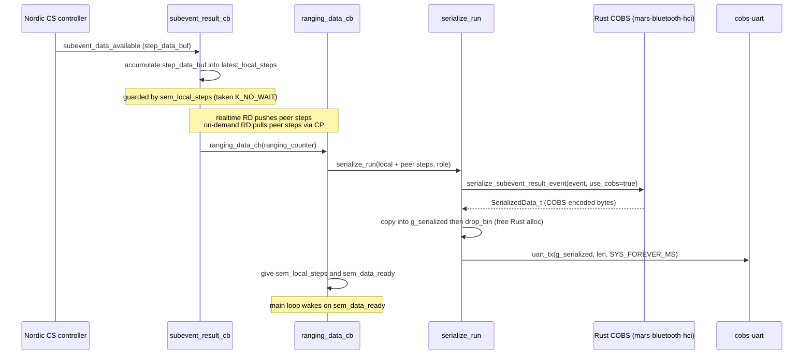

# Architecture

This is a code-derived contributor overview of the mars-cs-nrf54l firmware —
the module layout, the ranging-data flow, the initiator main loop, and the
configuration layer. To build, see the [README](../README.md); to flash prebuilt
firmware, see [docs/flash-quickstart.md](flash-quickstart.md); for board
overlays, UARTs, and antenna/path presets, see [docs/hardware.md](hardware.md).

This document describes how the firmware is built and how ranging data moves
through it. It does **not** introduce Channel Sounding technology itself — see
the [Bluetooth SIG Channel Sounding overview](https://www.bluetooth.com/channel-sounding-tech-overview/)
for that — and it does **not** reproduce the COBS wire format or the
`mars-bluetooth-hci` API (see the [mars-bluetooth-hci](https://github.com/Metirionic/mars-bluetooth-hci)
repo) or the preset/board table (see [docs/hardware.md](hardware.md)).

## Module map

Two firmware roles plus a shared library:

| Target | Role | Description | Build file |
|--------|------|-------------|------------|
| `initiator` | BLE Central / CS initiator | Scans for a CS reflector, connects, runs CS procedures, collects ranging data, and outputs COBS-encoded binary over UART | `initiator/CMakeLists.txt` |
| `reflector` | BLE Peripheral / CS reflector | Advertises the Ranging Service, accepts one connection, and answers CS procedures. Emits no COBS stream. | `reflector/CMakeLists.txt` |
| `common` | shared library | The `cs_common` static lib (linked by the initiator) plus selected files pulled in directly by each app | `common/CMakeLists.txt` |

### initiator

`initiator/src/`:

| File | Purpose (`@brief`) |
|------|---------------------|
| `main.c` | "Channel Sounding initiator with ranging requester sample" — app entry: registers the RAS callbacks, builds the `cs_initiator_config`, calls `cs_initiator_start`, and runs the main loop. `main()` at `initiator/src/main.c:124`. |
| `serialize.c` | "Channel Sounding data serializer" — parses local + peer step data into `SubeventResultEvent_t`, calls the Rust COBS serializer, and writes the bytes to the `cobs-uart` UART. |
| `serialize.h` | Prototype for `serialize_run`. |

`initiator/CMakeLists.txt`:

- Fetches the Rust crate `mars-bluetooth-hci@0.8.0` via CMake `FetchContent` (`:6-11`).
- Builds the shared `common` library as `cs_common` via `add_subdirectory(../common cs_common)` (`:22`).
- Compiles `src/main.c`, `src/serialize.c`, and `common/rust_callbacks.c` straight into `app` (`:24-25`) — note `common/rust_callbacks.c` is compiled into `app`, not into `cs_common`.
- Links `cs_common` (`:27`) and the Rust static archive (`:31-32`); exposes the generated Rust header to `cs_common` (`:28-29`).

### reflector

`reflector/src/`:

| File | Purpose (`@brief`) |
|------|---------------------|
| `main.c` | "Channel Sounding Reflector with Ranging Responder sample" — advertises the Ranging Service UUID, accepts one connection, configures the CS reflector role, and sets procedure parameters. `main()` at `reflector/src/main.c:243`. |

`reflector/CMakeLists.txt`:

- No `FetchContent`, no Rust, no `mars-bluetooth-hci-rust` — the reflector never serializes.
- Pulls only `src/main.c` and `common/antenna.c` directly into `app` (`:9-10`). It does **not** link `cs_common`.

### shared `common` library

`common/CMakeLists.txt` builds it as the `cs_common` static library
(`antenna.c ble_callbacks.c ble_scanning.c cs_initiator.c cs_step_parse.c addr_utils.c`,
`:4-5`), with `zephyr_interface` linked PRIVATE so the lib can use Zephyr headers
without pulling the full Zephyr target (`:7`).

**The `common` code is shared two different ways — call this out, it is not symmetric:**

- The **initiator** links `cs_common` *and* additionally compiles `common/rust_callbacks.c` straight into `app`.
- The **reflector** does **not** link `cs_common` at all — it compiles only `common/antenna.c` into its `app`. It needs just the antenna lookups, none of the initiator-side CS/RAS machinery.

`common/` source files:

| File | Purpose (`@brief`) |
|------|---------------------|
| `addr_utils.{c,h}` | "Shared BLE address utility functions" — `addr_to_u64()` packs a `bt_addr_le_t` into a `uint64_t`. |
| `antenna.{c,h}` | "Antenna configuration lookup tables for Channel Sounding" — `get_antenna_config()` / `get_preferred_peer_antenna()` map the Kconfig antenna/path counts to a CS tone-antenna config and a preferred-peer bitmask. |
| `ble_callbacks.{c,h}` | "Shared BLE connection and Channel Sounding callbacks" — owns the `BT_CONN_CB_DEFINE(conn_cb)` connection-callback table and the connection ref for the initiator; forwards CS subevent-data and config-created events to registered user callbacks; gives five of the setup semaphores. |
| `ble_scanning.{c,h}` | "BLE scanning and Ranging Service UUID filtering" — `scan_init()` configures `bt_scan` with a UUID filter for the Ranging Service and `connect_if_match`. |
| `cs_initiator.{c,h}` | "Shared Channel Sounding initiator connection and configuration flow" — the heart of the initiator: all setup semaphores, the step-data net buffers, the RAS feature bits, the MACs, and `cs_initiator_start()` which runs the full setup handshake; also defines the local `subevent_result_cb`. |
| `cs_step_parse.{c,h}` | "Shared CS step data parsing into SubeventResultEvent structures" — converts HCI Mode-2 step records into the Rust FFI `SubeventResultEvent_t` / `Step_t` / `Mode2_t` fields. |
| `rust_callbacks.c` | "Shared Rust FFI callback implementations" — the C functions the Rust runtime calls back into (`rust_panic_cb`, `rust_print_cb`). Compiled into the initiator `app` only. |
| `rust_ffi_types.h` | A re-include shim: `#include "mars_bluetooth_hci.h"` so `cs_step_parse.h` can name the Rust-generated `SubeventResultEvent_t` without depending on the include path setup directly. |

## The Rust COBS-serializer bridge

The initiator uses [mars-bluetooth-hci](https://github.com/Metirionic/mars-bluetooth-hci)
for COBS serialization. The reflector does not. This section describes how the
crate is fetched, built for the ARM target, and linked — the COBS wire format
itself lives in that external repo and is not reproduced here.

**Fetch.** The crate is fetched by CMake `FetchContent` in
`initiator/CMakeLists.txt:6-11` (`GIT_REPOSITORY …/mars-bluetooth-hci.git`,
`GIT_TAG mars-bluetooth-hci@0.8.0`), then `FetchContent_MakeAvailable`. It is
**not** a west project — `west.yml` fetches only NCS — and **not** a submodule. A
clean build clones it from GitHub at CMake-configure time (network needed on the
first configure; cached under `build/.../_deps` afterward).
`MARS_BT_HCI_RUST_DIR` is set to the inner crate dir (`:13`) and added to
`CMAKE_PREFIX_PATH` (`:16`) for `find_package(mars-bluetooth-hci-rust)` (`:17`).

**ARM build.** The crate's `mars-bluetooth-hci-rust-config.cmake` runs
`cargo build --lib --target thumbv8m.main-none-eabihf --release` as the
`build_mars_bt_hci_rust` custom target (`RUST_TARGET` is set at
`initiator/CMakeLists.txt:14`). For the firmware build the crate is built with
`--no-default-features --features libc,alloc,libc-panic,libc-alloc`, producing
`libmars_bluetooth_hci.a`.

**Linking.** `add_dependencies(app build_mars_bt_hci_rust)` makes the firmware
build wait on the cargo build, and
`target_link_libraries(app PRIVATE ${MARS_BT_HCI_RUST_LINK_LIBRARIES})` links the
imported static archive (`initiator/CMakeLists.txt:31-32`). The generated C header
reaches the C code through
`target_include_directories(cs_common PUBLIC ${MARS_BT_HCI_RUST_INCLUDE_DIRECTORIES})`
(`:28-29`).

**C → Rust entry points (live).** The firmware calls three Rust functions
declared in the generated `mars_bluetooth_hci.h` (auto-generated by `::safer_ffi`,
not `cbindgen`):

- `serialize_subevent_result_event(event, use_cobs)` — called with `use_cobs=true` at `initiator/src/serialize.c:88`.
- `serialize_log_message(msg, use_cobs)` — called with `use_cobs=true` at `initiator/src/serialize.c:68`.
- `drop_bin(SerializedData_t)` — frees the Rust allocation, called after each copy at `initiator/src/serialize.c:73,77,93,97`.

(The generated header also exports `new_dummy_data`, but the firmware does not call it.)

**Rust → C callbacks (by link-time symbol, no runtime registration).** The Rust
runtime calls back into C by symbol linkage:

- `rust_panic_cb` — defined at `common/rust_callbacks.c:22`, declared and used by the Rust `#[panic_handler]`.
- `malloc` / `free` — the Rust `#[global_allocator]` links against newlib, enabled by `CONFIG_NEWLIB_LIBC=y` (`initiator/prj.conf:27`).

(`rust_eh_personality` is exported by Rust for the linker's exception-handling support and is not called from C.)

_See [mars-bluetooth-hci](https://github.com/Metirionic/mars-bluetooth-hci) for
the wire format and the full FFI surface — they are not reproduced here._

## Ranging-data flow: CS procedure → RAS → serialize → COBS over UART

End-to-end on the initiator:

1. **CS procedure configured and started.** `cs_initiator_start()`
   (`common/cs_initiator.c:317`) runs a linear setup handshake, each step paced by
   a semaphore (see the next section): scan → connect → security → MTU exchange →
   GATT discovery of the Ranging Service → read RAS feature bits → exchange CS
   capabilities → create the CS config (`BT_CONN_LE_CS_MAIN_MODE_2_SUB_MODE_1`,
   role `BT_CONN_LE_CS_ROLE_INITIATOR`, `BT_CONN_LE_CS_RTT_TYPE_AA_ONLY`,
   `BT_CONN_LE_CS_CHSEL_TYPE_3B`) → enable CS security → set procedure parameters
   (using `get_antenna_config()` / `get_preferred_peer_antenna()`) → enable CS
   procedures. After it returns, procedures run autonomously in the controller.

2. **RAS receive.** Two receive modes, selected from the peer's RAS feature bits
   (`bt_ras_rreq_read_features` → `ras_feature_bits`, `common/cs_initiator.c:388`):

   - **Realtime RD** — `bt_ras_rreq_realtime_rd_subscribe(conn, &latest_peer_steps, ranging_data_cb)`
     (`common/cs_initiator.c:402`): the peer's ranging data is pushed straight to `ranging_data_cb`.
   - **On-demand RD** — subscribe to overwritten / ready / on-demand / CP
     notifications (`common/cs_initiator.c:411-432`); when the peer signals "ready",
     `ranging_data_ready_cb` pulls the peer data with
     `bt_ras_rreq_cp_get_ranging_data(conn, &latest_peer_steps, counter, ranging_data_cb)`
     (`initiator/src/main.c:104-107`), and `ranging_data_cb` fires on completion.

   The **local** side's CS subevent data arrives through the BLE connection
   callback `.le_cs_subevent_data_available` → `subevent_data_available_cb`
   (`common/ble_callbacks.c:87`) → `subevent_result_cb`
   (`common/cs_initiator.c:173`), which accumulates `result->step_data_buf` into
   the `latest_local_steps` net buffer.

3. **The callback.** `ranging_data_cb` (`initiator/src/main.c:32-95`) validates
   the peer ranging counter against the local one, drops on mismatch or on an
   all-aborted procedure, and otherwise calls
   `serialize_run(local_mac, peer_mac, latest_subevent_header, latest_local_steps, latest_peer_steps, cs_config.role)`
   (`:79-84`). It then resets the net buffers and gives `sem_local_steps` and
   `sem_data_ready` (`:93-94`). `cs_config.role` was saved earlier by
   `config_create_hook` (`initiator/src/main.c:119-122`).

4. **Serialize.** `serialize_run()` (`initiator/src/serialize.c:115-197`) fills
   `g_local_event` (`ORIGIN_INITIATOR`) and `g_peer_event` (`ORIGIN_REFLECTOR`)
   from the subevent header, then `cs_step_parse()` fills the `steps[160]` arrays
   from the local and peer step buffers. `serialize_append_event()` calls
   `serialize_subevent_result_event(p_event, true)` (Rust FFI, COBS on, `:88`); the
   returned `SerializedData_t` is copied into the static `g_serialized[]` buffer
   by `serialize_cb()` and then freed with `drop_bin()`. The same is done for the
   peer event, followed by a `serialize_log_message("Processing finished")`.

5. **COBS over UART.** `uart_tx(gp_cobs_uart_dev, g_serialized, g_total_written_size, SYS_FOREVER_MS)`
   (`initiator/src/serialize.c:189`) writes the COBS-encoded bytes to the UART.
   The UART device is acquired once at init:
   `gp_cobs_uart_dev = DEVICE_DT_GET(DT_CHOSEN(cobs_uart))` (`:31`). The async UART
   API is enabled (`CONFIG_UART_ASYNC_API=y`, `initiator/prj.conf:26`);
   `g_serialized` is `18360` bytes (`CHUNK_SIZE*2 + 1000`, `:24,27`).



The serialize + UART write runs **synchronously inside the RAS callback** — there
is no ring buffer, `k_work`, or `k_fifo` between the RAS callback and the UART.
The only synchronization is `sem_local_steps`, the binary lock guarding the
step-data net buffers between the producer (`subevent_result_cb`) and the
consumer (`ranging_data_cb`); see the next section.

## Semaphore-driven initiator main loop

There are ten `k_sem` instances in `common/cs_initiator.c:29-38`, in three groups.

**Eight one-shot setup semaphores** (`K_SEM_DEFINE(..., 0, 1)`) pace
`cs_initiator_start()`. Each is given by a BLE callback and taken `K_FOREVER` in
sequence inside the setup flow:

| Semaphore | Given by | Taken at |
|-----------|----------|----------|
| `sem_connected` | `connected_cb`, `common/ble_callbacks.c:112` | `common/cs_initiator.c:343` |
| `sem_security` | `security_changed`, `common/ble_callbacks.c:311` | `common/cs_initiator.c:359` |
| `sem_mtu_exchange_done` | `mtu_exchange_cb`, `common/cs_initiator.c:250` | `common/cs_initiator.c:363` |
| `sem_discovery_done` | `discovery_completed_cb`, `common/cs_initiator.c:276` | `common/cs_initiator.c:372` |
| `sem_ras_features` | `ras_features_read_cb`, `common/cs_initiator.c:169` | `common/cs_initiator.c:395` |
| `sem_remote_capabilities_obtained` | `remote_capabilities_cb`, `common/ble_callbacks.c:140` | `common/cs_initiator.c:447` |
| `sem_config_created` | `config_create_cb`, `common/ble_callbacks.c:222` | `common/cs_initiator.c:476` |
| `sem_cs_security_enabled` | `security_enable_cb`, `common/ble_callbacks.c:238` | `common/cs_initiator.c:485` |

Five of these are registered to the connection-callback table via
`ble_callbacks_register()` (`common/cs_initiator.c:321-325`); the other three
(MTU, GATT discovery, RAS features) are given by callbacks defined directly in
`common/cs_initiator.c`.

**`sem_local_steps`** (`K_SEM_DEFINE(sem_local_steps, 1, 1)`,
`common/cs_initiator.c:37`) is a **binary producer/consumer lock** (initial count
1, max 1) guarding the `latest_local_steps` / `latest_peer_steps` net buffers
between the producer (`subevent_result_cb`, takes `K_NO_WAIT` at
`common/cs_initiator.c:186` — it drops the procedure if it cannot take, recording
`dropped_ranging_counter`) and the consumer (`ranging_data_cb`, gives it back via
`cs_initiator_give_sem_local_steps()` at `initiator/src/main.c:93`).

**`sem_data_ready`** (`K_SEM_DEFINE(sem_data_ready, 0, 1)`,
`common/cs_initiator.c:29`) is the **only** semaphore the main loop waits on. It
is given at `initiator/src/main.c:94` — the last line of `ranging_data_cb`, after
`serialize_run` has returned.

**The main loop** (`initiator/src/main.c:158-161`) is a trivial keep-alive:

```c
while (true) {
    cs_initiator_take_sem_data_ready();
}
```

All the real work (RAS receive → parse → serialize → UART TX) happens in the RAS
callback context, not in the main thread. The loop exists to pace
procedure-to-procedure and keep the process alive.

For contrast, the reflector uses only two semaphores — `sem_connected` and
`sem_config` (`reflector/src/main.c:31-33`). Its `main()` loop
(`reflector/src/main.c:270-319`) waits on `sem_connected`, configures default CS
settings with `enable_reflector_role=true`, waits on `sem_config`, and sets the
procedure parameters; on disconnect it reboots (`reflector/src/main.c:78`), so
each boot runs one pass.

## devicetree / preset / board configuration layer

**devicetree chosen nodes.** Only one `DT_CHOSEN` / `DEVICE_DT_GET` call exists
in any `src/` directory: `cobs-uart` (`initiator/src/serialize.c:31`). The other
chosen nodes are set by the DK/U-Blox/Ezurio/Fanstel board overlays (the TAG
overlay sets only `cobs-uart`): `zephyr,console`, `zephyr,shell-uart`,
`zephyr,uart-mcumgr`, `zephyr,bt-mon-uart`, `zephyr,bt-c2h-uart`, consumed by
Zephyr subsystems (shell, mcumgr, bt-mon, bt-c2h), not by app code. The
`cs_antenna_switch` node is owned and consumed internally by the Nordic
controller library; no code in this repo reads `ant-gpios` (see
[docs/hardware.md](hardware.md#antenna-switch-node)).

**Presets → `west build`.** `CMakePresets.json` (per app) is the source of truth
for the preset → (board, overlay, conf-fragment) mapping. `ci/common.sh:28`
(`parse_preset`) reads it with a small Python snippet and extracts `BOARD`,
`CONF_FILE`, `EXTRA_CONF_FILE`, and `DTC_OVERLAY_FILE` from `cacheVariables`,
resolving each path relative to the app dir (`ci/common.sh:84-103`).
`ci/build.sh` then assembles the CMake args (`-DCONF_FILE`,
`-DEXTRA_CONF_FILE`, `-DDTC_OVERLAY_FILE`, `ci/build.sh:66-68`) and runs
`west build -b <BOARD>` from the NCS dir (`ci/build.sh:71`). `BOARD` is
`nrf54l15dk/nrf54l15/cpuapp` for every preset except the TAG presets, which use
`nrf54l15tag/nrf54l15/cpuapp` (their own base board). The overlay selects the
carrier. The full preset
table is in [docs/hardware.md](hardware.md#presets) — it is not reproduced here.

**`central.overlay` (initiator only).** Despite its `.overlay` extension this is a
Kconfig fragment that makes the initiator a scanning central
(`initiator/central.overlay:3-7`): `CONFIG_BT_CENTRAL`, `CONFIG_BT_SCAN`,
`CONFIG_BT_SCAN_FILTER_ENABLE`, `CONFIG_BT_SCAN_UUID_CNT`. No reflector preset
includes it — the reflector is a peripheral that advertises, not a central that
scans.

**Notable per-app Kconfig.** The CS/RAS/serializer-relevant symbols differ by
role and explain the module asymmetry above:

| Symbol | initiator `prj.conf` | reflector `prj.conf` | Why |
|--------|----------------------|----------------------|-----|
| `CONFIG_BT_RAS_RREQ` (RAS Requester — pulls ranging data) | `:24` | — | initiator pulls peer ranging data |
| `CONFIG_BT_RAS_RRSP` (RAS Responder — serves ranging data) | — | `:41` | reflector serves ranging data |
| `CONFIG_BT_CENTRAL` / `CONFIG_BT_SCAN` | `:17-20` (also `central.overlay`) | — | initiator scans; reflector advertises (`CONFIG_BT_PERIPHERAL`, `:11`) |
| `CONFIG_UART_ASYNC_API` | `:26` | — | COBS TX path (async `uart_tx`) |
| `CONFIG_NEWLIB_LIBC` | `:27` | — | provides `malloc`/`free` for the Rust allocator |
| `CONFIG_FPU` / `CONFIG_FPU_SHARING` | `:51-52` | — | the parser writes `float` PCT values into the Rust structs |
| `CONFIG_HEAP_MEM_POOL_SIZE=32768` / `CONFIG_MAIN_STACK_SIZE=10000` | `:54-55` | — | Rust allocator + serialize stack headroom |

Both apps set `CONFIG_BT_CHANNEL_SOUNDING`, `CONFIG_BT_RAS`, the Ranging Profile
MTU sizing, and the RAM-saving Mode-3 / reassembly options. The antenna/path
counts themselves come from the `boards/*_local.conf` fragments and feed
`common/antenna.c` — see [docs/hardware.md](hardware.md#kconfig-fragments).

## Design notes (contributor gotchas)

- **Serialize + UART TX is gated on a TX-complete handshake.** `serialize_run()`
  registers a `uart_callback_set` handler that signals `UART_TX_DONE` /
  `UART_TX_ABORTED` via the `sem_tx_done` semaphore, and takes that semaphore
  before reusing the static `g_serialized[]` buffer, so `uart_tx()` is never
  called while a previous transfer is still DMA-ing out of it (no on-wire
  COBS corruption, no `-EBUSY`) (`initiator/src/serialize.c`). The procedure
  cadence is `min/max_procedure_interval = 10/10` connection events (200 ms at
  the 20 ms connection interval, `initiator/src/main.c:207-208`); in steady
  state the prior TX finishes before the next procedure completes, so the gate
  returns immediately, and under jitter it blocks only for the brief overshoot
  in the quiet gap between procedures. Keep this in mind before changing the
  serialize path or the procedure cadence.
- **`mars_bluetooth_hci.h` is checked into the crate, not regenerated during the
  firmware build.** The crate's CMake runs only `cargo build --lib`, not the
  header-generator bin, so the firmware consumes the pre-generated header.
  Changing the Rust FFI surface requires regenerating the header separately before
  the C side sees it.
- **`rust_print_cb` is defined but currently unused by the Rust crates.**
  `common/rust_callbacks.c:34` defines it, but only `rust_panic_cb` is declared and
  called by the Rust side. Do not expect Rust log output to route through
  `rust_print_cb`.

## Out of scope

- An introduction to Channel Sounding technology itself (see the
  [Bluetooth SIG Channel Sounding overview](https://www.bluetooth.com/channel-sounding-tech-overview/)).
- Reproducing the COBS wire format or the `mars-bluetooth-hci` API (see the
  [mars-bluetooth-hci](https://github.com/Metirionic/mars-bluetooth-hci) repo).
- The board / preset / fragment table (see [docs/hardware.md](hardware.md)).
- Physical antenna wiring, RF placement, and tuning (see `docs/hardware.md`).
- The NCS-owned `cs_antenna_switch` binding internals.
- A generated documentation site.

## References

- [README](../README.md) — build flow and the preset-table link.
- [docs/hardware.md](hardware.md) — boards, UARTs, and antenna/path presets.
- [docs/flash-quickstart.md](flash-quickstart.md) — flashing prebuilt firmware.
- [Bluetooth Channel Sounding — technology overview](https://www.bluetooth.com/channel-sounding-tech-overview/)
  — what Channel Sounding is (authoritative background; the firmware implements
  CS, this doc does not re-explain the technology).
- [mars-bluetooth-hci](https://github.com/Metirionic/mars-bluetooth-hci) — COBS
  serialization library (authoritative wire-format source).
- [nRF Connect SDK](https://developer.nordicsemi.com/nRF_Connect_SDK/) — the
  `bt_le_cs_*` / `bt_ras_rreq_*` APIs and the controller-owned antenna switch.
