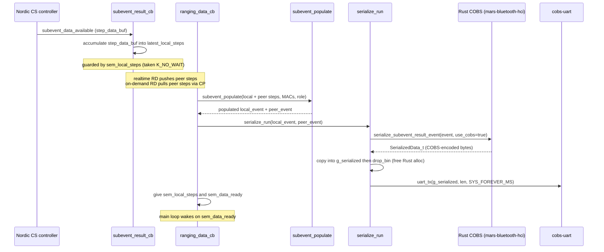
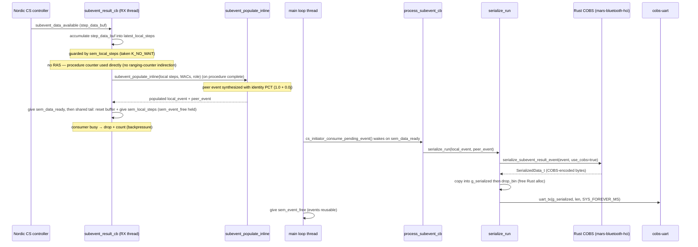

# Architecture

This is a code-derived contributor overview of the mars-cs-nrf54l firmware —
the module layout, the ranging-data flow, the initiator main loop, and the
configuration layer. To build, see
[docs/build-from-source.md](build-from-source.md); to flash prebuilt firmware,
see [docs/flash-quickstart.md](flash-quickstart.md); for board overlays, UARTs,
and antenna/path presets, see [docs/hardware.md](hardware.md).

This document describes how the firmware is built and how ranging data moves
through it. It does **not** introduce Channel Sounding technology itself — see
the [Bluetooth SIG Channel Sounding overview](https://www.bluetooth.com/channel-sounding-tech-overview/)
for that — and it does **not** reproduce the COBS wire format or the
`mars-bluetooth-hci` API (see the [mars-bluetooth-hci](https://github.com/Metirionic/mars-bluetooth-hci)
repo) or the preset/board table (see [docs/hardware.md](hardware.md)).

## Module map

Two firmware roles plus a shared library:

| Target | Role | Description | Build file |
|--------|------|-------------|------------|
| `initiator` | BLE Central / CS initiator | Scans for a CS reflector, connects, runs CS procedures, collects ranging data, and outputs COBS-encoded binary over UART | `initiator/CMakeLists.txt` |
| `reflector` | BLE Peripheral / CS reflector | Advertises the Ranging Service, accepts one connection, and answers CS procedures. Emits no COBS stream. | `reflector/CMakeLists.txt` |
| `common` | shared library | The `cs_common` static lib (linked by the initiator) plus selected files pulled in directly by each app | `common/CMakeLists.txt` |

### initiator

`initiator/src/`:

| File | Purpose (`@brief`) |
|------|---------------------|
| `main.c` | "Channel Sounding initiator with ranging requester sample" — app entry: registers the ranging callbacks (RAS `ranging_data_cb` / `ranging_data_ready_cb`, or IPT `process_subevent_cb`), builds the `cs_initiator_config`, calls `cs_initiator_start`, and runs the main loop. `main()` at `initiator/src/main.c:233`. |
| `serialize.c` | "Channel Sounding data serializer" — parses local + peer step data into `SubeventResultEvent_t`, calls the Rust COBS serializer, and writes the bytes to the `cobs-uart` UART. |
| `serialize.h` | Prototype for `serialize_run`. |

`initiator/CMakeLists.txt`:

- Fetches the Rust crate `mars-bluetooth-hci@0.13.2` via CMake `FetchContent` (`:6-11`).
- Builds the shared `common` library as `cs_common` via `add_subdirectory(../common cs_common)` (`:22`).
- Compiles `src/main.c`, `src/serialize.c`, and `common/rust_callbacks.c` straight into `app` (`:24-25`) — note `common/rust_callbacks.c` is compiled into `app`, not into `cs_common`.
- Links `cs_common` (`:27`) and the Rust static archive (`:31-32`); exposes the generated Rust header to `cs_common` (`:28-29`).

### reflector

`reflector/src/`:

| File | Purpose (`@brief`) |
|------|---------------------|
| `main.c` | "Channel Sounding Reflector with Ranging Responder sample" — advertises (the Ranging Service UUID in RAS, or its device name in IPT), accepts one connection, and configures the CS reflector role; in RAS it also sets procedure parameters (in IPT the reflector is passive and sets none). `main()` at `reflector/src/main.c:319`. |

`reflector/CMakeLists.txt`:

- No `FetchContent`, no Rust, no `mars-bluetooth-hci-rust` — the reflector never serializes.
- Pulls only `src/main.c` and `common/antenna.c` directly into `app` (`:9-10`). It does **not** link `cs_common`.

### shared `common` library

`common/CMakeLists.txt` builds it as the `cs_common` static library
(`antenna.c ble_callbacks.c ble_scanning.c cs_initiator.c cs_step_parse.c cs_watchdog.c subevent.c addr_utils.c`,
`:4-13`), with `zephyr_interface` linked PRIVATE so the lib can use Zephyr
headers without pulling the full Zephyr target (`:15`).

**The `common` code is shared two different ways — call this out, it is not symmetric:**

- The **initiator** links `cs_common` *and* additionally compiles `common/rust_callbacks.c` straight into `app`.
- The **reflector** does **not** link `cs_common` at all — it compiles only `common/antenna.c` into its `app`. It needs just the antenna lookups, none of the initiator-side CS/RAS machinery.

`common/` source files:

| File | Purpose (`@brief`) |
|------|---------------------|
| `addr_utils.{c,h}` | "Shared BLE address utility functions" — `addr_to_u64()` packs a `bt_addr_le_t` into a `uint64_t`. |
| `antenna.{c,h}` | "Antenna configuration lookup tables for Channel Sounding" — `get_antenna_config()` / `get_preferred_peer_antenna()` map the Kconfig antenna/path counts to a CS tone-antenna config and a preferred-peer bitmask. |
| `ble_callbacks.{c,h}` | "Shared BLE connection and Channel Sounding callbacks" — owns the `BT_CONN_CB_DEFINE(conn_cb)` connection-callback table and the connection ref for the initiator; forwards CS subevent-data and config-created events to registered user callbacks; gives five of the setup semaphores. |
| `ble_scanning.{c,h}` | "BLE scanning and Ranging Service UUID filtering" — `scan_init()` configures `bt_scan` with `connect_if_match` and a filter that selects the peer by **Ranging Service UUID** (RAS) or by **advertised name** (IPT — the reflector does not advertise that UUID, so the initiator matches `CONFIG_BT_DEVICE_NAME` instead). |
| `cs_initiator.{c,h}` | "Shared Channel Sounding initiator connection and configuration flow" — the heart of the initiator: all setup semaphores, the step-data net buffers, the RAS feature bits, the MACs, and `cs_initiator_start()` which runs the full setup handshake; also defines the local `subevent_result_cb`. |
| `cs_step_parse.{c,h}` | "Shared CS step data parsing into SubeventResultEvent structures" — `cs_step_parse()` (RAS) converts local + peer HCI Mode-2 step records into the Rust FFI `SubeventResultEvent_t` / `Step_t` / `Mode2_t` fields; also populates the Mode-0 calibration steps (kind per role from the step `data_len`, measured frequency offset passed through raw); `cs_step_parse_inline()` (IPT) parses the local steps only and synthesizes the peer event per step with a transparent identity (1.0 + 0.0j) Phase Correction Term for Mode-2 and a zeroed `MODE0_REFLECTOR` step for Mode-0, so the downstream combiner sees a structurally valid `ORIGIN_REFLECTOR` event with a no-op phase rotation. |
| `cs_watchdog.{c,h}` | "CS liveness watchdog" — the #116 recovery mechanism: a timer pets only on completed procedures with step data (initiator) or completed subevents with steps (reflector); on timeout it invokes the registered recovery callback (both apps force a disconnect that reboots the pair). Built into `cs_common`, so both roles link it. |
| `subevent.{c,h}` | "CS subevent data parsing into SubeventResultEvent structures" — `subevent_populate()` (RAS) fills the initiator + reflector events from both the local and peer step buffers via `cs_step_parse()`; `subevent_populate_inline()` (IPT) fills them from the local step buffer only via `cs_step_parse_inline()` (the reflector's phase contribution is embedded in the local tones, so there is no peer buffer). Both seed the shared header through `fill_subevent_header()`. |
| `rust_callbacks.c` | "Shared Rust FFI callback implementations" — the C functions the Rust runtime calls back into (`rust_panic_cb`, `rust_print_cb`). Compiled into the initiator `app` only. |
| `rust_ffi_types.h` | A re-include shim: `#include "mars_bluetooth_hci.h"` so `cs_step_parse.h` can name the Rust-generated `SubeventResultEvent_t` without depending on the include path setup directly. |

## The Rust COBS-serializer bridge

The initiator uses [mars-bluetooth-hci](https://github.com/Metirionic/mars-bluetooth-hci)
for COBS serialization. The reflector does not. This section describes how the
crate is fetched, built for the ARM target, and linked — the COBS wire format
itself lives in that external repo and is not reproduced here.

**Fetch.** The crate is fetched by CMake `FetchContent` in
`initiator/CMakeLists.txt:6-11` (`GIT_REPOSITORY …/mars-bluetooth-hci.git`,
`GIT_TAG mars-bluetooth-hci@0.13.2`), then `FetchContent_MakeAvailable`. It is
**not** a west project — `west.yml` fetches only NCS — and **not** a submodule. A
clean build clones it from GitHub at CMake-configure time (network needed on the
first configure; cached under `build/.../_deps` afterward).
`MARS_BT_HCI_RUST_DIR` is set to the inner crate dir (`:13`) and added to
`CMAKE_PREFIX_PATH` (`:16`) for `find_package(mars-bluetooth-hci-rust)` (`:17`).

**ARM build.** The crate's `mars-bluetooth-hci-rust-config.cmake` runs
`cargo build --lib --target thumbv8m.main-none-eabihf --release` as the
`build_mars_bt_hci_rust` custom target (`RUST_TARGET` is set at
`initiator/CMakeLists.txt:14`). For the firmware build the crate is built with
`--no-default-features --features libc,alloc,libc-panic,libc-alloc`, producing
`libmars_bluetooth_hci.a`.

**Linking.** `add_dependencies(app build_mars_bt_hci_rust)` makes the firmware
build wait on the cargo build, and
`target_link_libraries(app PRIVATE ${MARS_BT_HCI_RUST_LINK_LIBRARIES})` links the
imported static archive (`initiator/CMakeLists.txt:31-32`). The generated C header
reaches the C code through
`target_include_directories(cs_common PUBLIC ${MARS_BT_HCI_RUST_INCLUDE_DIRECTORIES})`
(`:28-29`).

**C → Rust entry points (live).** The firmware calls three Rust functions
declared in the generated `mars_bluetooth_hci.h` (auto-generated by `::safer_ffi`,
not `cbindgen`):

- `serialize_subevent_result_event(event, use_cobs)` — called with `use_cobs=true` at `initiator/src/serialize.c:109` (inside `serialize_append_event`).
- `serialize_log_message(msg, use_cobs)` — called with `use_cobs=true` at `initiator/src/serialize.c:89` (inside `serialize_append_log_message`).
- `drop_bin(SerializedData_t)` — frees the Rust allocation, called after each copy at `initiator/src/serialize.c:94,98,114,118`.

(The generated header also exports `new_dummy_data`, but the firmware does not call it.)

**Rust → C callbacks (by link-time symbol, no runtime registration).** The Rust
runtime calls back into C by symbol linkage:

- `rust_panic_cb` — defined at `common/rust_callbacks.c:22`, declared and used by the Rust `#[panic_handler]`.
- `malloc` / `free` — the Rust `#[global_allocator]` links against newlib, enabled by `CONFIG_NEWLIB_LIBC=y` (`initiator/prj.conf:32`).

(`rust_eh_personality` is exported by Rust for the linker's exception-handling support and is not called from C.)

_See [mars-bluetooth-hci](https://github.com/Metirionic/mars-bluetooth-hci) for
the wire format and the full FFI surface — they are not reproduced here._

## Ranging-data flow

The firmware has two ranging modes, selected at build time by
`CONFIG_MARS_CS_INLINE_PCT` (`common/Kconfig`):

- **RAS** (Ranging Service) — the initiator pulls the peer's step data over a
  GATT Ranging Service and combines it with its own.
- **IPT** (inline Phase Correction Term) — the reflector's phase contribution is
  embedded in the local tones, so the initiator uses its own step data only and
  there is no RAS GATT path.

Both modes converge on the same output: a `SubeventResultEvent_t` pair is
populated, then `serialize_run()` COBS-encodes it via the Rust FFI and writes the
bytes to the `cobs-uart` UART — the same `mars-bluetooth-hci` wire format either
way (there is no separate host-decoder story for IPT). The modes differ only in
the **acquisition** half — how the step data is gathered and when the events are
populated. RAS is *peer-data-driven* (serialization waits for the peer's RAS
ranging data to arrive); IPT is *local-data-driven* (serialization runs as soon as
the local procedure completes).

### RAS path

End-to-end on the initiator:

1. **CS procedure configured and started.** `cs_initiator_start()`
   (`common/cs_initiator.c:484`) runs a linear setup handshake, each step paced by
   a semaphore (see the next section): scan (Ranging Service UUID filter) → connect
   → security → MTU exchange → GATT discovery of the Ranging Service → read RAS
   feature bits → exchange CS capabilities → create the CS config
   (`BT_CONN_LE_CS_MAIN_MODE_2_SUB_MODE_1`, role `BT_CONN_LE_CS_ROLE_INITIATOR`,
   `BT_CONN_LE_CS_RTT_TYPE_AA_ONLY`, `BT_CONN_LE_CS_CHSEL_TYPE_3B`) → enable CS
   security → set procedure parameters (using `get_antenna_config()` /
   `get_preferred_peer_antenna()`) → enable CS procedures. After it returns,
   procedures run autonomously in the controller.

2. **RAS receive.** Two receive modes, selected from the peer's RAS feature bits
   (`bt_ras_rreq_read_features` → `ras_feature_bits`, set in `ras_features_read_cb`
   at `common/cs_initiator.c:260`; the read is issued at `:560`):

   - **Realtime RD** — `bt_ras_rreq_realtime_rd_subscribe(conn, &latest_peer_steps, ranging_data_cb)`
     (`common/cs_initiator.c:573`): the peer's ranging data is pushed straight to `ranging_data_cb`.
   - **On-demand RD** — subscribe to overwritten / ready / on-demand / CP
     notifications (`common/cs_initiator.c:582-608`); when the peer signals "ready",
     `ranging_data_ready_cb` pulls the peer data with
     `bt_ras_rreq_cp_get_ranging_data(conn, &latest_peer_steps, counter, ranging_data_cb)`
     (`initiator/src/main.c:175-178`), and `ranging_data_cb` fires on completion.

   The **local** side's CS subevent data arrives through the BLE connection
   callback `.le_cs_subevent_data_available` → `subevent_data_available_cb`
   (`common/ble_callbacks.c:89`) → `subevent_result_cb`
   (`common/cs_initiator.c:277`), which accumulates `result->step_data_buf` into
   the `latest_local_steps` net buffer.

3. **Populate and serialize.** `ranging_data_cb` (`initiator/src/main.c:60-166`)
   validates the peer ranging counter against the local one, drops on mismatch or
   on an all-aborted procedure, and otherwise calls
   `subevent_populate(&local_event, &peer_event, cs_initiator_get_local_mac(), cs_initiator_get_peer_mac(), cs_initiator_get_latest_subevent_header(), latest_local_steps, cs_initiator_get_peer_steps(), cs_config.role)`
   (`:146-153`) — `subevent_populate()` (`common/subevent.c:77`) fills both event
   headers via `fill_subevent_header()` and hands the local + peer step buffers to
   `cs_step_parse()`, which fills the `steps[]` arrays — then calls
   `serialize_run(&local_event, &peer_event)` (`:155`). It then resets the net
   buffers and gives `sem_local_steps` and `sem_data_ready` (`:164-165`).
   `cs_config.role` was saved earlier by `config_create_hook`
   (`initiator/src/main.c:191-194`).

4. **Serialize + COBS over UART.** `serialize_run()` (`initiator/src/serialize.c:240-316`)
   gates on the `sem_tx_done` TX-complete handshake, then `serialize_append_event()`
   calls `serialize_subevent_result_event(p_event, true)` (Rust FFI, COBS on,
   `:109`) for each of the local and peer events; the returned `SerializedData_t` is
   copied into the static `g_serialized[]` buffer by `serialize_cb()` and freed
   with `drop_bin()`, followed by a `serialize_log_message("Processing finished")`.
   Finally `uart_tx(gp_cobs_uart_dev, g_serialized, g_total_written_size, SYS_FOREVER_MS)`
   (`:298`) writes the COBS-encoded bytes to the UART. The UART device is acquired
   once at init: `gp_cobs_uart_dev = DEVICE_DT_GET(DT_CHOSEN(cobs_uart))` (`:44`).
   The async UART API is enabled (`CONFIG_UART_ASYNC_API=y`, `initiator/prj.conf:26`);
   `g_serialized` is `29000` bytes (`CHUNK_SIZE*2 + 1000`, `serialize.c:37,40`).


```mermaid
sequenceDiagram
    participant CTRL as Nordic CS controller
    participant ACC as subevent_result_cb
    participant RAS as ranging_data_cb
    participant POP as subevent_populate
    participant SER as serialize_run
    participant RUST as Rust COBS (mars-bluetooth-hci)
    participant UART as cobs-uart
    CTRL->>ACC: subevent_data_available (step_data_buf)
    ACC->>ACC: accumulate step_data_buf into latest_local_steps
    Note over ACC: guarded by sem_local_steps (taken K_NO_WAIT)
    Note over ACC,RAS: realtime RD pushes peer steps<br/>on-demand RD pulls peer steps via CP
    RAS->>POP: subevent_populate(local + peer steps, MACs, role)
    POP-->>RAS: populated local_event + peer_event
    RAS->>SER: serialize_run(local_event, peer_event)
    SER->>RUST: serialize_subevent_result_event(event, use_cobs=true)
    RUST-->>SER: SerializedData_t (COBS-encoded bytes)
    SER->>SER: copy into g_serialized then drop_bin (free Rust alloc)
    SER->>UART: uart_tx(g_serialized, len, SYS_FOREVER_MS)
    RAS->>RAS: give sem_local_steps and sem_data_ready
    Note over RAS: main loop wakes on sem_data_ready
```

The serialize + UART write runs **synchronously inside `ranging_data_cb`** — there
is no ring buffer, `k_work`, or `k_fifo` between the callback and the UART. The
only synchronization is `sem_local_steps`, the binary lock guarding the step-data
net buffers between the producer (`subevent_result_cb`) and the consumer
(`ranging_data_cb`); see the next section.

### IPT path

IPT (`CONFIG_MARS_CS_INLINE_PCT=y`) drops the RAS GATT path entirely: the
reflector's phase contribution is embedded in the local tones, so the initiator
never reads peer step data. The reflector is passive — it advertises only its
device name (no Ranging Service UUID) and lets the initiator drive all of the CS
setup.

1. **CS procedure configured and started.** `cs_initiator_start()` runs the same
   handshake, but the RAS-specific steps — MTU exchange, GATT discovery of the
   Ranging Service, and the RAS feature read + subscribe — are compiled out
   (`#if !IS_ENABLED(CONFIG_MARS_CS_INLINE_PCT)`, `common/cs_initiator.c:528-542`
   and `:558-610`). The CS config is created with
   `BT_CONN_LE_CS_MAIN_MODE_2_NO_SUB_MODE` and `cs_enhancements_1 = 1` to enable
   inline PCT transfer (`:621-639`); `scan_init()` matches the reflector's
   advertised name, not the Ranging Service UUID (`common/ble_scanning.c:86-98`).

2. **Local-only acquisition.** The local CS subevent data arrives the same way —
   `.le_cs_subevent_data_available` → `subevent_data_available_cb`
   (`common/ble_callbacks.c:89`) → `subevent_result_cb`
   (`common/cs_initiator.c:277`), which accumulates `result->step_data_buf` into
   `latest_local_steps` (guarded by `sem_local_steps`, taken `K_NO_WAIT` at
   `:295`). There is no RAS ranging-counter indirection: the procedure counter is
   used directly (`procedure_ranging_counter = result->header.procedure_counter`,
   `:288`), and there is no `latest_peer_steps` buffer.

3. **Populate and hand off.** On procedure complete
   (`BT_CONN_LE_CS_PROCEDURE_COMPLETE`), `subevent_result_cb` calls
   `subevent_populate_inline(&g_local_event, &g_peer_event, g_local_mac, g_peer_mac, &g_latest_subevent_header, &latest_local_steps, BT_CONN_LE_CS_ROLE_INITIATOR)`
   (`common/cs_initiator.c:377-383`).
   `subevent_populate_inline()` (`common/subevent.c:119`) fills both
   event headers and, via `cs_step_parse_inline()`, parses the **local** steps only
   — the peer (reflector) event is synthesized per step with a transparent identity
   (1.0 + 0.0j) Phase Correction Term, so the downstream combiner sees a structurally
   valid `ORIGIN_REFLECTOR` event with a no-op phase rotation. The skeleton then
   releases the step buffer and hands the populated event pair to the consumer
   thread through the `sem_event_free` / `sem_data_ready` handshake (below). The
   cascade decides only the differing part; the shared tail after it
   (`common/cs_initiator.c:388-389`) resets the net buffer and returns the
   `sem_local_steps` token once for every outcome. Three cases:
   - **Empty procedure** (`latest_local_steps.len == 0`, `:363-366`): LOG_WRN
     only — do **not** wake the consumer (nothing to consume), so the warning
     log is the only trace; the shared tail still recovers `sem_local_steps`.
   - **Consumer busy** (`sem_event_free` held — the main loop is still
     serializing the previous event pair, `:367-374`): drop the procedure,
     counted in `g_event_backlog_drops` (LOG_WRN on the first drop and every
     128th). This is the deliberate backpressure valve; see the threading note
     below.
   - **Otherwise** (`:377-385`): populate, give `sem_data_ready`. An aborted
     procedure resets the buffer and does **not** wake the consumer
     (`common/cs_initiator.c:392-401`), mirroring the RAS error path.

4. **Serialize + COBS over UART (main loop thread).** The main loop calls
   `cs_initiator_consume_pending_event()` (`initiator/src/main.c:306`, defined at
   `common/cs_initiator.c:193-203`), which waits on `sem_data_ready` (`:195`),
   runs the app's `process_subevent_cb` → `serialize_run()` on the **main loop
   thread**, then releases `sem_event_free` (`:202`). Same wire format, same
   `mars-bluetooth-hci` output as RAS; there is no separate host-decoder story.


```mermaid
sequenceDiagram
    participant CTRL as Nordic CS controller
    participant ACC as subevent_result_cb (RX thread)
    participant POP as subevent_populate_inline
    participant MAIN as main loop thread
    participant CB as process_subevent_cb
    participant SER as serialize_run
    participant RUST as Rust COBS (mars-bluetooth-hci)
    participant UART as cobs-uart
    CTRL->>ACC: subevent_data_available (step_data_buf)
    ACC->>ACC: accumulate step_data_buf into latest_local_steps
    Note over ACC: guarded by sem_local_steps (taken K_NO_WAIT)
    Note over ACC: no RAS — procedure counter used directly (no ranging-counter indirection)
    ACC->>POP: subevent_populate_inline(local steps, MACs, role) (on procedure complete)
    Note over POP: peer event synthesized with identity PCT (1.0 + 0.0j)
    POP-->>ACC: populated local_event + peer_event
    ACC->>ACC: give sem_data_ready, then shared tail: reset buffer + give sem_local_steps (sem_event_free held)
    Note over ACC: consumer busy → drop + count (backpressure)
    MAIN->>CB: cs_initiator_consume_pending_event() wakes on sem_data_ready
    CB->>SER: serialize_run(local_event, peer_event)
    SER->>RUST: serialize_subevent_result_event(event, use_cobs=true)
    RUST-->>SER: SerializedData_t (COBS-encoded bytes)
    SER->>SER: copy into g_serialized then drop_bin (free Rust alloc)
    SER->>UART: uart_tx(g_serialized, len, SYS_FOREVER_MS)
    MAIN->>MAIN: give sem_event_free (events reusable)
```

The populate runs on the **RX thread** but the serialize + UART write runs on the
**main loop thread** — the deliberate split that fixes #173. One ~26.6 KB COBS
event takes ~289 ms to DMA out at 921600 baud (≈3.5 events/s wire limit); run
that inline in the RX thread and the HCI step-data delivery backs up, the SDC
aborts the surplus subevents, and the procedures complete empty (the #173
symptom: ~70 % empty completions at `procedure_interval = 1`). With the handoff,
the SDC runs every procedure at the full cadence and surplus events drop at the
`sem_event_free` gate instead — visibly, with a counted warning. The wire rate
still caps the output at ~3.5 events/s; raising the procedure cadence above that
increases the drop rate, it does not lose data silently.
`sem_local_steps` still guards `latest_local_steps` between the accumulator and
the populate (same-thread now, but the lock also paces procedure-to-procedure);
the app's `process_subevent_cb` (watchdog pet + serialize) runs on the main loop
thread via `cs_initiator_consume_pending_event()`.

## Semaphore-driven initiator main loop

There are ten `k_sem` instances in a RAS build — seven unconditional
(`common/cs_initiator.c:32-38`) plus three RAS-only (`:50-52`, under
`#if IS_ENABLED(CONFIG_BT_RAS_RREQ)`) — in three groups; an IPT build compiles
the seven plus the IPT-only handoff `sem_event_free`
(`common/cs_initiator.c:42`), since it does no MTU exchange, GATT discovery, or
RAS-feature read.

**One-shot setup semaphores** (`K_SEM_DEFINE(..., 0, 1)`) pace
`cs_initiator_start()`. Five are shared by both modes; three (MTU, GATT
discovery, RAS features) are RAS-only. Each is given by a BLE callback and taken
`K_FOREVER` in sequence inside the setup flow:

| Semaphore | Given by | Taken at | Mode |
|-----------|----------|----------|------|
| `sem_connected` | `connected_cb`, `common/ble_callbacks.c:114` | `common/cs_initiator.c:510` | both |
| `sem_security` | `security_changed`, `common/ble_callbacks.c:313` | `common/cs_initiator.c:526` | both |
| `sem_mtu_exchange_done` | `mtu_exchange_cb`, `common/cs_initiator.c:416` | `common/cs_initiator.c:532` | RAS only |
| `sem_discovery_done` | `discovery_completed_cb`, `common/cs_initiator.c:442` | `common/cs_initiator.c:541` | RAS only |
| `sem_ras_features` | `ras_features_read_cb`, `common/cs_initiator.c:272` | `common/cs_initiator.c:567` | RAS only |
| `sem_remote_capabilities_obtained` | `remote_capabilities_cb`, `common/ble_callbacks.c:142` | `common/cs_initiator.c:619` | both |
| `sem_config_created` | `config_create_cb`, `common/ble_callbacks.c:224` | `common/cs_initiator.c:652` | both |
| `sem_cs_security_enabled` | `security_enable_cb`, `common/ble_callbacks.c:240` | `common/cs_initiator.c:661` | both |

Five of these are registered to the connection-callback table via
`ble_callbacks_register()` (`common/cs_initiator.c:488-492`); the other three
(MTU, GATT discovery, RAS features — all RAS-only) are given by callbacks defined
directly in `common/cs_initiator.c`.

**`sem_local_steps`** (`K_SEM_DEFINE(sem_local_steps, 1, 1)`,
`common/cs_initiator.c:38`) is a **binary producer/consumer lock** (initial count
1, max 1) guarding the `latest_local_steps` net buffer (and, in RAS,
`latest_peer_steps`) between the producer and the consumer. The producer is
`subevent_result_cb` in both modes — it takes `K_NO_WAIT` at
`common/cs_initiator.c:295` and drops the procedure if it cannot take, recording
`dropped_ranging_counter`. In **RAS** the consumer is `ranging_data_cb`, which
gives it back via `cs_initiator_give_sem_local_steps()` at
`initiator/src/main.c:164`. In **IPT** the lock paces procedure-to-procedure
inside `subevent_result_cb`: taken at the start of a new procedure, given back
after the populate-and-handoff (or drop) at procedure completion
(`common/cs_initiator.c:389`).

**`sem_event_free`** (IPT only, `K_SEM_DEFINE(sem_event_free, 1, 1)`,
`common/cs_initiator.c:42`) is the **RX-thread → main-loop handoff** for the
populated event pair: the RX thread takes it `K_NO_WAIT` before populating
(`common/cs_initiator.c:367`; a failed take = the consumer is still serializing
→ drop the procedure, counted in `g_event_backlog_drops`), and
`cs_initiator_consume_pending_event()` gives it back after the app's process
callback returns (`common/cs_initiator.c:202`). This is the #173 valve — it
keeps the ~289 ms serialize + UART TX path off the RX thread while making the
overflow visible instead of turning surplus procedures into controller aborts.

**`sem_data_ready`** (`K_SEM_DEFINE(sem_data_ready, 0, 1)`,
`common/cs_initiator.c:32`) is the only semaphore the main loop waits on. In
**RAS** it is given at the end of `ranging_data_cb`
(`initiator/src/main.c:165`) — after `serialize_run` has returned — and the main
loop only parks on it. In **IPT** it means "a populated event pair is pending":
the RX thread gives it after populating (not after serializing), and the main
loop's `cs_initiator_consume_pending_event()` takes it and runs the
serialize + UART TX path. IPT's empty-procedure path does **not** give it —
there is nothing to consume.

**The main loop** (`initiator/src/main.c:300-310`, end of `main()`) parks in RAS
and consumes in IPT:

```c
while (true) {
#if IS_ENABLED(CONFIG_MARS_CS_INLINE_PCT)
    cs_initiator_consume_pending_event();  /* runs watchdog pet + serialize + UART TX */
#else
    cs_initiator_take_sem_data_ready();
#endif
}
```

In **IPT** the main loop thread is the serialize consumer — the real work splits
across two threads: acquire → parse → populate on the RX thread, serialize →
UART TX on the main thread. In **RAS** everything still happens in the ranging
callback context (`ranging_data_cb`), and the loop exists to pace
procedure-to-procedure and keep the process alive.

For contrast, the reflector uses only two semaphores — `sem_connected` and
`sem_config` (`reflector/src/main.c:34-36`). Its `main()` loop
(`reflector/src/main.c:319-421`) waits on `sem_connected`, configures default CS
settings with `enable_reflector_role=true`, then — in **RAS** — waits on
`sem_config` and sets the procedure parameters; on disconnect it reboots
(`reflector/src/main.c:88`), so each boot runs one pass. In **IPT** the reflector
is passive: it `continue`s past the CS setup (`reflector/src/main.c:377`) and sets
neither procedure parameters nor the Ranging Service — the initiator drives all CS
setup — so only `sem_connected` is ever taken.

## devicetree / preset / board configuration layer

**devicetree chosen nodes.** Only one `DT_CHOSEN` call exists in any `src/`
directory: `cobs-uart` (`initiator/src/serialize.c:44`) — the initiator's one
other `DEVICE_DT_GET` is the RF-switch supply GPIO
(`initiator/src/main.c:237`). The other
chosen nodes are set by the DK/U-Blox/Ezurio/Fanstel board overlays (the TAG
overlay sets only `cobs-uart`): `zephyr,console`, `zephyr,shell-uart`,
`zephyr,uart-mcumgr`, `zephyr,bt-mon-uart`, `zephyr,bt-c2h-uart`, consumed by
Zephyr subsystems (shell, mcumgr, bt-mon, bt-c2h), not by app code. The
`cs_antenna_switch` node is owned and consumed internally by the Nordic
controller library; no code in this repo reads `ant-gpios` (see
[docs/hardware.md](hardware.md#antenna-switch-node)).

**Presets → `west build`.** `CMakePresets.json` (per app) is the source of truth
for the preset → (board, overlay, conf-fragment) mapping. `ci/common.sh:44`
(`parse_preset`) reads it with a small Python snippet and extracts `BOARD`,
`CONF_FILE`, `EXTRA_CONF_FILE`, and `DTC_OVERLAY_FILE` from `cacheVariables`,
resolving each path relative to the app dir (`ci/common.sh:74-119`).
`ci/build.sh` then assembles the CMake args (`-DCONF_FILE`,
`-DEXTRA_CONF_FILE`, `-DDTC_OVERLAY_FILE`, `ci/build.sh:66-68`) and runs
`west build -b <BOARD>` from the NCS dir (`ci/build.sh:71`). `BOARD` is
`nrf54l15dk/nrf54l15/cpuapp` for every preset except the TAG presets, which use
`nrf54l15tag/nrf54l15/cpuapp` (their own base board). The overlay selects the
carrier. The full preset
table is in [docs/hardware.md](hardware.md#presets) — it is not reproduced here.

**`central.overlay` (initiator only).** Despite its `.overlay` extension this is a
Kconfig fragment that makes the initiator a scanning central
(`initiator/central.overlay:3-7`): `CONFIG_BT_CENTRAL`, `CONFIG_BT_SCAN`,
`CONFIG_BT_SCAN_FILTER_ENABLE`, `CONFIG_BT_SCAN_UUID_CNT`. No reflector preset
includes it — the reflector is a peripheral that advertises, not a central that
scans.

**Notable per-app Kconfig.** Both modes build from the same `prj.conf` (the RAS
defaults below); IPT presets override the RAS symbols via the `inline_pct_*.conf`
fragments (table after). The CS/RAS/serializer-relevant symbols differ by role and
explain the module asymmetry above:

| Symbol | initiator `prj.conf` | reflector `prj.conf` | Why |
|--------|----------------------|----------------------|-----|
| `CONFIG_BT_RAS_RREQ` (RAS Requester — pulls ranging data) | `:24` | — | initiator pulls peer ranging data |
| `CONFIG_BT_RAS_RRSP` (RAS Responder — serves ranging data) | — | `:41` | reflector serves ranging data |
| `CONFIG_BT_CENTRAL` / `CONFIG_BT_SCAN` | `:17-20` (also `central.overlay`) | — | initiator scans; reflector advertises (`CONFIG_BT_PERIPHERAL`, `:11`) |
| `CONFIG_UART_ASYNC_API` | `:26` | — | COBS TX path (async `uart_tx`) |
| `CONFIG_NEWLIB_LIBC` | `:32` | — | provides `malloc`/`free` for the Rust allocator |
| `CONFIG_FPU` / `CONFIG_FPU_SHARING` | `:56-57` | — | the parser writes `float` PCT values into the Rust structs |
| `CONFIG_HEAP_MEM_POOL_SIZE=32768` / `CONFIG_MAIN_STACK_SIZE=10000` | `:59-60` | — | Rust allocator + serialize stack headroom |

**IPT overrides (`boards/inline_pct_*.conf`).** The IPT presets layer
`inline_pct_shared.conf` + `inline_pct_initiator.conf` (or `inline_pct_reflector.conf`)
on top of `prj.conf` via `EXTRA_CONF_FILE`, overriding the RAS defaults above:

| Symbol | initiator fragment | reflector fragment | Why |
|--------|--------------------|--------------------|-----|
| `CONFIG_MARS_CS_INLINE_PCT` | `inline_pct_initiator.conf:10` (`y`) | `inline_pct_reflector.conf:10` (`y`) | enables IPT mode; `select`s `CONFIG_BT_CTLR_EXTENDED_FEAT_SET` (`common/Kconfig:9-12`) |
| `CONFIG_BT_RAS` / `CONFIG_BT_RAS_RREQ` | `inline_pct_initiator.conf:13-14` (`n`) | — | RAS GATT path unused in IPT |
| `CONFIG_BT_RAS_RRSP` | — | `inline_pct_reflector.conf:15` (`n`) | RAS responder unused in IPT |
| `CONFIG_BT_GATT_CLIENT` / `CONFIG_BT_GATT_DYNAMIC_DB` | `inline_pct_initiator.conf:19-20` (`n`) | — | no GATT discovery (no Ranging Service to find) |
| `CONFIG_BT_SCAN_UUID_CNT` / `CONFIG_BT_SCAN_NAME_CNT` | `inline_pct_initiator.conf:21` (`0`) / `:30` (`1`) | — | scan by advertised name, not Ranging Service UUID |
| `CONFIG_BT_CTLR_EXTENDED_FEAT_SET` | (via `select`) | `inline_pct_reflector.conf:11` (`y`) | controller CS enhancements for inline PCT transfer |
| `CONFIG_BT_DEVICE_NAME` | `inline_pct_shared.conf:10` | `inline_pct_shared.conf:10` | the IPT reflector's advertised name (single source of truth — the initiator scans for it) |

Both apps' `prj.conf` sets `CONFIG_BT_CHANNEL_SOUNDING`, `CONFIG_BT_RAS`, the
Ranging Profile MTU sizing, and the RAM-saving Mode-3 / reassembly options; IPT
overrides `CONFIG_BT_RAS` and the RAS requestor/responder roles to `n` (see the
IPT table above). The antenna/path counts themselves come from the
`boards/*_local.conf` fragments (applied by both RAS and IPT presets) and feed
`common/antenna.c` — see [docs/hardware.md](hardware.md#kconfig-fragments).

## Design notes (contributor gotchas)

- **Serialize + UART TX is gated on a TX-complete handshake — and runs off the
  RX thread (IPT).** `serialize_run()` registers a `uart_callback_set` handler
  that signals `UART_TX_DONE` / `UART_TX_ABORTED` via the `sem_tx_done`
  semaphore, and takes that semaphore before reusing the static `g_serialized[]`
  buffer, so `uart_tx()` is never called while a previous transfer is still
  DMA-ing out of it (no on-wire COBS corruption, no `-EBUSY`)
  (`initiator/src/serialize.c`). One event is ~26.6 KB ≈ 289 ms at 921600 baud
  (≈3.5 events/s wire limit). In **RAS** that blocking still runs inside
  `ranging_data_cb` (RX context) — at the default
  `min/max_procedure_interval = 10/10` cadence the prior TX finishes within the
  gap, so the gate returns immediately. In **IPT** the #173 fix moved the
  blocking to the main loop thread (`cs_initiator_consume_pending_event()`);
  running it back in the RX thread would starve the SDC's step-data delivery
  and turn surplus procedures into controller aborts (the ~70 % empty
  completions of #173). Keep this in mind before changing the serialize path or
  the procedure cadence — and remember the RAS path still has the #173-shaped
  coupling, so the same starvation is possible there at tightened cadences.
- **`mars_bluetooth_hci.h` is checked into the crate, not regenerated during the
  firmware build.** The crate's CMake runs only `cargo build --lib`, not the
  header-generator bin, so the firmware consumes the pre-generated header.
  Changing the Rust FFI surface requires regenerating the header separately before
  the C side sees it.
- **`rust_print_cb` is defined but currently unused by the Rust crates.**
  `common/rust_callbacks.c:34` defines it, but only `rust_panic_cb` is declared and
  called by the Rust side. Do not expect Rust log output to route through
  `rust_print_cb`.

## Out of scope

- An introduction to Channel Sounding technology itself (see the
  [Bluetooth SIG Channel Sounding overview](https://www.bluetooth.com/channel-sounding-tech-overview/)).
- Reproducing the COBS wire format or the `mars-bluetooth-hci` API (see the
  [mars-bluetooth-hci](https://github.com/Metirionic/mars-bluetooth-hci) repo).
- The board / preset / fragment table (see [docs/hardware.md](hardware.md)).
- Physical antenna wiring, RF placement, and tuning (see `docs/hardware.md`).
- The NCS-owned `cs_antenna_switch` binding internals.
- A generated documentation site.

## References

- [README](../README.md) — project overview, firmware variants, and the flash and build entry points.
- [docs/hardware.md](hardware.md) — boards, UARTs, and antenna/path presets.
- [docs/flash-quickstart.md](flash-quickstart.md) — flashing prebuilt firmware.
- [Bluetooth Channel Sounding — technology overview](https://www.bluetooth.com/channel-sounding-tech-overview/)
  — what Channel Sounding is (authoritative background; the firmware implements
  CS, this doc does not re-explain the technology).
- [mars-bluetooth-hci](https://github.com/Metirionic/mars-bluetooth-hci) — COBS
  serialization library (authoritative wire-format source).
- [nRF Connect SDK](https://developer.nordicsemi.com/nRF_Connect_SDK/) — the
  `bt_le_cs_*` / `bt_ras_rreq_*` APIs and the controller-owned antenna switch.
